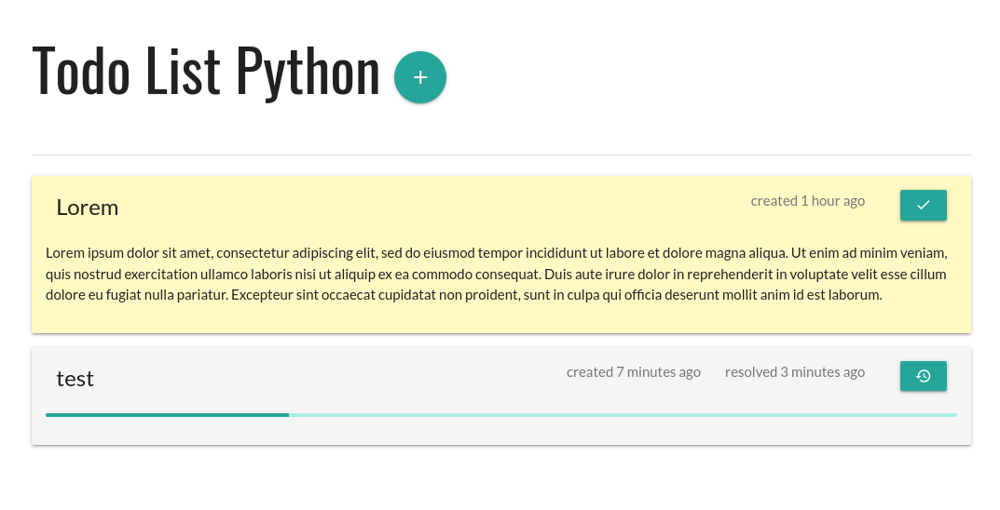

# Info

Simple app made for fun and education purposes.

## Tech stack

- [Svelte](https://svelte.dev/) - frontend
- [FastAPI](https://fastapi.tiangolo.com/) - backend
  - [python-redis-om](https://github.com/redis/redis-om-python) - objects mapping
- [Redis](https://redis.io/) - storage

# Screenshots

## Main screen

## Adding new task

